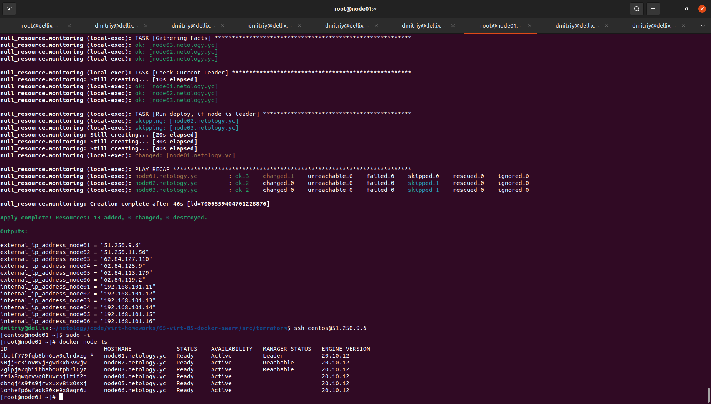
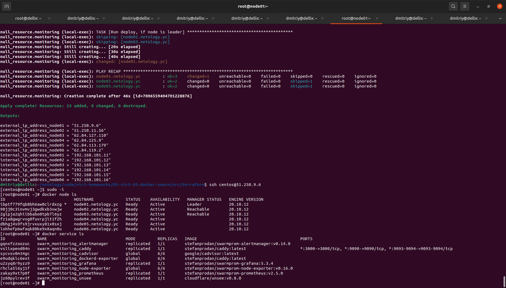

# Домашнее задание к занятию "5.5. Оркестрация кластером Docker контейнеров на примере Docker Swarm"

## Как сдавать задания

Обязательными к выполнению являются задачи без указания звездочки. Их выполнение необходимо для получения зачета и диплома о профессиональной переподготовке.

Задачи со звездочкой (*) являются дополнительными задачами и/или задачами повышенной сложности. Они не являются обязательными к выполнению, но помогут вам глубже понять тему.

Домашнее задание выполните в файле readme.md в github репозитории. В личном кабинете отправьте на проверку ссылку на .md-файл в вашем репозитории.

Любые вопросы по решению задач задавайте в чате учебной группы.

---

## Задача 1

Дайте письменые ответы на следующие вопросы:

- В чём отличие режимов работы сервисов в Docker Swarm кластере: replication и global?
- Какой алгоритм выбора лидера используется в Docker Swarm кластере? RAFT
- Что такое Overlay Network?

  Ответ:
  
- В режиме global, сервис запускается в одном экземпляре на каждом узле Docker Swarm кластера.
- В режиме replication указывается число запущенных реплик сервиса (их количество может отличаться от количества нод в кластере).
- Overlay Network - подсеть, которую могут использовать контейнеры в разных хостах swarm-кластера. Контейнеры на разных физических хостах могут обмениваться данными по overlay-сети (если все они прикреплены к одной сети).
## Задача 2

Создать ваш первый Docker Swarm кластер в Яндекс.Облаке

Для получения зачета, вам необходимо предоставить скриншот из терминала (консоли), с выводом команды:
```
docker node ls
```

```bash
dmitriy@dellix:~/netology/code/virt-homeworks/05-virt-05-docker-swarm/src/terraform$ ssh centos@51.250.9.6
[centos@node01 ~]$ sudo -i
[root@node01 ~]# docker node ls
ID                            HOSTNAME             STATUS    AVAILABILITY   MANAGER STATUS   ENGINE VERSION
ibptf779fqb8bh6aw0clrdxzg *   node01.netology.yc   Ready     Active         Leader           20.10.12
90jj0c3invmvj3gwdkxb3vwjw     node02.netology.yc   Ready     Active         Reachable        20.10.12
2glpja2qhiibbabo0tpb7l6yz     node03.netology.yc   Ready     Active         Reachable        20.10.12
fz1a8gwgrvvg0fuvrpjlt1f2h     node04.netology.yc   Ready     Active                          20.10.12
dbhgj4s9fs9jrvxuxy81x0sxj     node05.netology.yc   Ready     Active                          20.10.12
lohhefp6wfaqk80ke9x8aqn0u     node06.netology.yc   Ready     Active                          20.10.12
```



## Задача 3

Создать ваш первый, готовый к боевой эксплуатации кластер мониторинга, состоящий из стека микросервисов.

Для получения зачета, вам необходимо предоставить скриншот из терминала (консоли), с выводом команды:
```
docker service ls
```

```bash
[root@node01 ~]# docker service ls
ID             NAME                                MODE         REPLICAS   IMAGE                                          PORTS
gqnxfzzoozuc   swarm_monitoring_alertmanager       replicated   1/1        stefanprodan/swarmprom-alertmanager:v0.14.0    
vslixpeod04n   swarm_monitoring_caddy              replicated   1/1        stefanprodan/caddy:latest                      *:3000->3000/tcp, *:9090->9090/tcp, *:9093-9094->9093-9094/tcp
sycvsv8m34gc   swarm_monitoring_cadvisor           global       6/6        google/cadvisor:latest                         
e9udqklc6ext   swarm_monitoring_dockerd-exporter   global       6/6        stefanprodan/caddy:latest                      
u2zyq8r9yzz9   swarm_monitoring_grafana            replicated   1/1        stefanprodan/swarmprom-grafana:5.3.4           
rhcla5l6yj1f   swarm_monitoring_node-exporter      global       6/6        stefanprodan/swarmprom-node-exporter:v0.16.0   
zakay9xt7p0f   swarm_monitoring_prometheus         replicated   1/1        stefanprodan/swarmprom-prometheus:v2.5.0       
jz60pylrev3f   swarm_monitoring_unsee              replicated   1/1        cloudflare/unsee:v0.8.0  
```



## Задача 4 (*)

Выполнить на лидере Docker Swarm кластера команду (указанную ниже) и дать письменное описание её функционала, что она делает и зачем она нужна:
```
# см.документацию: https://docs.docker.com/engine/swarm/swarm_manager_locking/
docker swarm update --autolock=true
```

Ответ:
Журналы Raft, используемые менеджерами swarm, по умолчанию зашифрованы на диске. Это шифрование конфигурацию и данные вашего сервиса от злоумышленников, которые получают доступ к зашифрованным журналам Raft. Одна из причин, по которой эта функция была введена, заключалась в поддержке функции секретов Docker .

При перезапуске Docker в память каждого управляющего узла загружается как ключ TLS, используемый для шифрования связи между узлами swarm, так и ключ, используемый для шифрования и расшифровки журналов Raft на диске. Docker может защитить общий ключ шифрования TLS и ключ, используемый для шифрования и расшифровки журналов Raft при не запущенном кластере, позволяя вам стать владельцем этих ключей и требовать ручной разблокировки ваших менеджеров. Эта функция называется автоблокировкой .

Когда Docker перезапустится, вы должны сначала разблокировать swarm, используя ключ шифрования, сгенерированный Docker, когда swarm был заблокирован. Этот ключ видно на выводе команды из задачи (SWMKEY-1-wtLZAuOPCfVG2z2dp6b9mTbT70E8KqKSIfNHHLWszhE).

- такую автоблокировку можно включить при инициализации кластера swarm, командой 
```bash
docker swarm init --autolock 
```

Представленная в задаче команда включает автоблокировку на уже созданном кластере, после ее запуска рестарт или останов-запуск docker потребуют ввода команды
```bash
docker swarm unlock
```
с последующим вводом ключа разблокировки.


    Таким образом данная команда включает автоблокировку существующего кластера swarm.

вот ее вывод.
```bash
[root@node01 ~]# docker swarm update --autolock=true
Swarm updated.
To unlock a swarm manager after it restarts, run the `docker swarm unlock`
command and provide the following key:

    SWMKEY-1-wtLZAuOPCfVG2z2dp6b9mTbT70E8KqKSIfNHHLWszhE

Please remember to store this key in a password manager, since without it you
will not be able to restart the manager.
```
