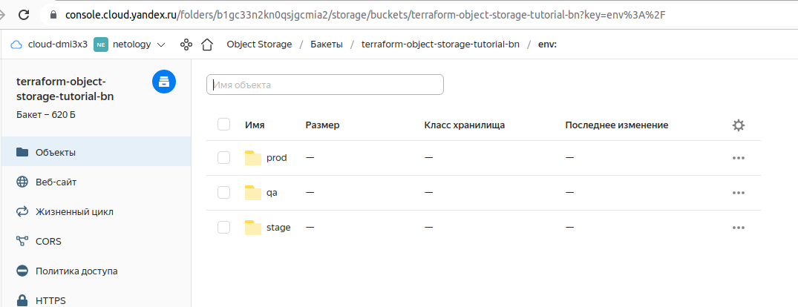

# Домашнее задание к занятию "7.3. Основы и принцип работы Терраформ"

## Задача 1. Создадим бэкэнд в S3 (необязательно, но крайне желательно).

Если в рамках предыдущего задания у вас уже есть аккаунт AWS, то давайте продолжим знакомство со взаимодействием
терраформа и aws. 

1. Создайте s3 бакет, iam роль и пользователя от которого будет работать терраформ. Можно создать отдельного пользователя,
а можно использовать созданного в рамках предыдущего задания, просто добавьте ему необходимы права, как описано 
[здесь](https://www.terraform.io/docs/backends/types/s3.html).
1. Зарегистрируйте бэкэнд в терраформ проекте как описано по ссылке выше. 


## Задача 2. Инициализируем проект и создаем воркспейсы. 

1. Выполните `terraform init`:
    * если был создан бэкэнд в S3, то терраформ создат файл стейтов в S3 и запись в таблице 
dynamodb.
    * иначе будет создан локальный файл со стейтами.

    Создал s3 backend в Яндекс.Облаке 


2. Создайте два воркспейса `stage` и `prod`.
3. В уже созданный `aws_instance` добавьте зависимость типа инстанса от вокспейса, что бы в разных ворскспейсах 
использовались разные `instance_type`.
 
    Добавил еще один воркспейс - qa, привожу часть массива locals, в которой описывается наполнение инстансов ресурсами.

```shell
 news_cores = {
    stage = 2
    prod = 2
    qa = 2
  }
  news_platform_id = {
    stage = "standard-v2"
    prod = "standard-v2"
    qa = "standard-v1"
  }
  news_disk_size = {
    stage = 20
    prod = 30
    qa = 15
  }
```

4. Добавим `count`. Для `stage` должен создаться один экземпляр `ec2`, а для `prod` два. 

<details>
  <summary>Нажмите, чтобы увидеть содержимое файла main.tf со счетчиком.</summary>
  
```shell
resource "yandex_compute_instance" "vm" {
  count = 2
  name = "vm-${count.index}"

  resources {
    cores  = 2
    memory = 2
  }

  boot_disk {
    initialize_params {
      image_id = "fd8ciuqfa001h8s9sa7i"
    }
  }

  network_interface {
    subnet_id = yandex_vpc_subnet.subnet-1.id
    nat       = true
  }

  metadata = {
    ssh-keys = "ubuntu:${file("~/.ssh/id_rsa.pub")}"
  }
}

resource "yandex_vpc_network" "network-1" {
  name = "network1"
}

resource "yandex_vpc_subnet" "subnet-1" {
  name           = "subnet1"
  zone           = "ru-central1-a"
  network_id     = yandex_vpc_network.network-1.id
  v4_cidr_blocks = ["192.168.10.0/24"]
}

output "internal_ip_address_vm" {
  value = yandex_compute_instance.vm.*.network_interface.0.ip_address
}


output "external_ip_address_vm" {
  value = yandex_compute_instance.vm.*.network_interface.0.nat_ip_address
}

output "subnet-1" {
  value = yandex_vpc_subnet.subnet-1.id
}

```

</details>

5. Создайте рядом еще один `aws_instance`, но теперь определите их количество при помощи `for_each`, а не `count`.

 создал 3 виртуалки в яндекс.облаке с применением for_each, запустить несколько воркспейсов одновременно не дает ограничение Яндекс на количество сетей. 

  <details>
  <summary>Нажмите, чтобы раскрыть листинг команды terraform apply</summary>

```shell

dmitriy@dellix:~/netology_1/virt-homeworks-my/07-terraform-03-basic_ys3_for-each$ terraform apply 

Terraform used the selected providers to generate the following execution plan. Resource actions are indicated with the following symbols:
  + create

Terraform will perform the following actions:

  # yandex_compute_instance.vm["vm-1"] will be created
  + resource "yandex_compute_instance" "vm" {
      + created_at                = (known after apply)
      + folder_id                 = (known after apply)
      + fqdn                      = (known after apply)
      + hostname                  = (known after apply)
      + id                        = (known after apply)
      + metadata                  = {
          + "ssh-keys" = <<-EOT
                ubuntu:ssh-rsa AAAAB3NzaC1yc2EAAAABJQAAAgEAjq0dHpBcPLscFJ1dvS1YJZ/AZqlVUmiJaAqS/2nr8KGRn0GSr8yXY9XjbBZLyTkxEbpA+IK2FFUPmYOtH0C/E4wjHssunP7FdEluWs2H+QnrGbq7Wwkl6VJ3gTX3WuTtCjKRRak+TSwP/QH2VnSchLPZdVTw/LpwvShNR7LLYTGqq1dXeIEYjVdtxFkraTCyDmcXKbFzP/w/xzB5FEn89Alp03XlYP4IY/OHSVcG+4N3H3ocrPaRkmZ4WsAN+hFnbpBnpP2VKJpYwH9pJiee4MtzXU81wjvPz6jKCI2NilKWZNfQ44Ywe7NVrWm0iRTuK38oAoiA2znHDQmMjiE9qV/B2RLO6yk+t/zpkvKPIK2MeLBxYf2WF5GuPadMMJb5jib1h0w9zbWLI9XGPLdp4Ym+TrVlZeTEQZeapvN5kdhu/QpNEkPeBnokq9qGgvYwBpPy34gQ5dezp0qWAbdkeS6ecZf38TeQaLorYT51tGMI6uMoS43LBgvd+7NF7jOkpIsMNAlak8ANw5/Cs8H1wuU495Mr4PU6FW/oP2FBQqWsQld1N5UWauiKSrlURH5EHTDFmfnkahlGgy110kXwG+26vF5cidCvmzuq7DT9FgYnxCQgqMD1s/Ln41+wH5QjCBdCV/1JRZXFfnz+gCdek7eH+4HZjxb2Kuc974IOQUE= rsa-key
            EOT
        }
      + name                      = "vm-1"
      + network_acceleration_type = "standard"
      + platform_id               = "standard-v1"
      + service_account_id        = (known after apply)
      + status                    = (known after apply)
      + zone                      = (known after apply)

      + boot_disk {
          + auto_delete = true
          + device_name = (known after apply)
          + disk_id     = (known after apply)
          + mode        = (known after apply)

          + initialize_params {
              + block_size  = (known after apply)
              + description = (known after apply)
              + image_id    = "fd8ciuqfa001h8s9sa7i"
              + name        = (known after apply)
              + size        = (known after apply)
              + snapshot_id = (known after apply)
              + type        = "network-hdd"
            }
        }

      + network_interface {
          + index              = (known after apply)
          + ip_address         = (known after apply)
          + ipv4               = true
          + ipv6               = (known after apply)
          + ipv6_address       = (known after apply)
          + mac_address        = (known after apply)
          + nat                = true
          + nat_ip_address     = (known after apply)
          + nat_ip_version     = (known after apply)
          + security_group_ids = (known after apply)
          + subnet_id          = (known after apply)
        }

      + placement_policy {
          + host_affinity_rules = (known after apply)
          + placement_group_id  = (known after apply)
        }

      + resources {
          + core_fraction = 100
          + cores         = 2
          + memory        = 2
        }

      + scheduling_policy {
          + preemptible = (known after apply)
        }
    }

  # yandex_compute_instance.vm["vm-2"] will be created
  + resource "yandex_compute_instance" "vm" {
      + created_at                = (known after apply)
      + folder_id                 = (known after apply)
      + fqdn                      = (known after apply)
      + hostname                  = (known after apply)
      + id                        = (known after apply)
      + metadata                  = {
          + "ssh-keys" = <<-EOT
                ubuntu:ssh-rsa AAAAB3NzaC1yc2EAAAABJQAAAgEAjq0dHpBcPLscFJ1dvS1YJZ/AZqlVUmiJaAqS/2nr8KGRn0GSr8yXY9XjbBZLyTkxEbpA+IK2FFUPmYOtH0C/E4wjHssunP7FdEluWs2H+QnrGbq7Wwkl6VJ3gTX3WuTtCjKRRak+TSwP/QH2VnSchLPZdVTw/LpwvShNR7LLYTGqq1dXeIEYjVdtxFkraTCyDmcXKbFzP/w/xzB5FEn89Alp03XlYP4IY/OHSVcG+4N3H3ocrPaRkmZ4WsAN+hFnbpBnpP2VKJpYwH9pJiee4MtzXU81wjvPz6jKCI2NilKWZNfQ44Ywe7NVrWm0iRTuK38oAoiA2znHDQmMjiE9qV/B2RLO6yk+t/zpkvKPIK2MeLBxYf2WF5GuPadMMJb5jib1h0w9zbWLI9XGPLdp4Ym+TrVlZeTEQZeapvN5kdhu/QpNEkPeBnokq9qGgvYwBpPy34gQ5dezp0qWAbdkeS6ecZf38TeQaLorYT51tGMI6uMoS43LBgvd+7NF7jOkpIsMNAlak8ANw5/Cs8H1wuU495Mr4PU6FW/oP2FBQqWsQld1N5UWauiKSrlURH5EHTDFmfnkahlGgy110kXwG+26vF5cidCvmzuq7DT9FgYnxCQgqMD1s/Ln41+wH5QjCBdCV/1JRZXFfnz+gCdek7eH+4HZjxb2Kuc974IOQUE= rsa-key
            EOT
        }
      + name                      = "vm-2"
      + network_acceleration_type = "standard"
      + platform_id               = "standard-v1"
      + service_account_id        = (known after apply)
      + status                    = (known after apply)
      + zone                      = (known after apply)

      + boot_disk {
          + auto_delete = true
          + device_name = (known after apply)
          + disk_id     = (known after apply)
          + mode        = (known after apply)

          + initialize_params {
              + block_size  = (known after apply)
              + description = (known after apply)
              + image_id    = "fd8ciuqfa001h8s9sa7i"
              + name        = (known after apply)
              + size        = (known after apply)
              + snapshot_id = (known after apply)
              + type        = "network-hdd"
            }
        }

      + network_interface {
          + index              = (known after apply)
          + ip_address         = (known after apply)
          + ipv4               = true
          + ipv6               = (known after apply)
          + ipv6_address       = (known after apply)
          + mac_address        = (known after apply)
          + nat                = true
          + nat_ip_address     = (known after apply)
          + nat_ip_version     = (known after apply)
          + security_group_ids = (known after apply)
          + subnet_id          = (known after apply)
        }

      + placement_policy {
          + host_affinity_rules = (known after apply)
          + placement_group_id  = (known after apply)
        }

      + resources {
          + core_fraction = 100
          + cores         = 2
          + memory        = 2
        }

      + scheduling_policy {
          + preemptible = (known after apply)
        }
    }

  # yandex_compute_instance.vm["vm-3"] will be created
  + resource "yandex_compute_instance" "vm" {
      + created_at                = (known after apply)
      + folder_id                 = (known after apply)
      + fqdn                      = (known after apply)
      + hostname                  = (known after apply)
      + id                        = (known after apply)
      + metadata                  = {
          + "ssh-keys" = <<-EOT
                ubuntu:ssh-rsa AAAAB3NzaC1yc2EAAAABJQAAAgEAjq0dHpBcPLscFJ1dvS1YJZ/AZqlVUmiJaAqS/2nr8KGRn0GSr8yXY9XjbBZLyTkxEbpA+IK2FFUPmYOtH0C/E4wjHssunP7FdEluWs2H+QnrGbq7Wwkl6VJ3gTX3WuTtCjKRRak+TSwP/QH2VnSchLPZdVTw/LpwvShNR7LLYTGqq1dXeIEYjVdtxFkraTCyDmcXKbFzP/w/xzB5FEn89Alp03XlYP4IY/OHSVcG+4N3H3ocrPaRkmZ4WsAN+hFnbpBnpP2VKJpYwH9pJiee4MtzXU81wjvPz6jKCI2NilKWZNfQ44Ywe7NVrWm0iRTuK38oAoiA2znHDQmMjiE9qV/B2RLO6yk+t/zpkvKPIK2MeLBxYf2WF5GuPadMMJb5jib1h0w9zbWLI9XGPLdp4Ym+TrVlZeTEQZeapvN5kdhu/QpNEkPeBnokq9qGgvYwBpPy34gQ5dezp0qWAbdkeS6ecZf38TeQaLorYT51tGMI6uMoS43LBgvd+7NF7jOkpIsMNAlak8ANw5/Cs8H1wuU495Mr4PU6FW/oP2FBQqWsQld1N5UWauiKSrlURH5EHTDFmfnkahlGgy110kXwG+26vF5cidCvmzuq7DT9FgYnxCQgqMD1s/Ln41+wH5QjCBdCV/1JRZXFfnz+gCdek7eH+4HZjxb2Kuc974IOQUE= rsa-key
            EOT
        }
      + name                      = "vm-3"
      + network_acceleration_type = "standard"
      + platform_id               = "standard-v1"
      + service_account_id        = (known after apply)
      + status                    = (known after apply)
      + zone                      = (known after apply)

      + boot_disk {
          + auto_delete = true
          + device_name = (known after apply)
          + disk_id     = (known after apply)
          + mode        = (known after apply)

          + initialize_params {
              + block_size  = (known after apply)
              + description = (known after apply)
              + image_id    = "fd8ciuqfa001h8s9sa7i"
              + name        = (known after apply)
              + size        = (known after apply)
              + snapshot_id = (known after apply)
              + type        = "network-hdd"
            }
        }

      + network_interface {
          + index              = (known after apply)
          + ip_address         = (known after apply)
          + ipv4               = true
          + ipv6               = (known after apply)
          + ipv6_address       = (known after apply)
          + mac_address        = (known after apply)
          + nat                = true
          + nat_ip_address     = (known after apply)
          + nat_ip_version     = (known after apply)
          + security_group_ids = (known after apply)
          + subnet_id          = (known after apply)
        }

      + placement_policy {
          + host_affinity_rules = (known after apply)
          + placement_group_id  = (known after apply)
        }

      + resources {
          + core_fraction = 100
          + cores         = 2
          + memory        = 2
        }

      + scheduling_policy {
          + preemptible = (known after apply)
        }
    }

  # yandex_vpc_network.network-1 will be created
  + resource "yandex_vpc_network" "network-1" {
      + created_at                = (known after apply)
      + default_security_group_id = (known after apply)
      + folder_id                 = (known after apply)
      + id                        = (known after apply)
      + labels                    = (known after apply)
      + name                      = "network1"
      + subnet_ids                = (known after apply)
    }

  # yandex_vpc_subnet.subnet-1 will be created
  + resource "yandex_vpc_subnet" "subnet-1" {
      + created_at     = (known after apply)
      + folder_id      = (known after apply)
      + id             = (known after apply)
      + labels         = (known after apply)
      + name           = "subnet1"
      + network_id     = (known after apply)
      + v4_cidr_blocks = [
          + "192.168.10.0/24",
        ]
      + v6_cidr_blocks = (known after apply)
      + zone           = "ru-central1-a"
    }

Plan: 5 to add, 0 to change, 0 to destroy.

Changes to Outputs:
  + in-networks  = [
      + {
          + network = "vm-1"
          + value   = (known after apply)
        },
      + {
          + network = "vm-2"
          + value   = (known after apply)
        },
      + {
          + network = "vm-3"
          + value   = (known after apply)
        },
    ]
  + out-networks = [
      + {
          + network = "vm-1"
          + value   = (known after apply)
        },
      + {
          + network = "vm-2"
          + value   = (known after apply)
        },
      + {
          + network = "vm-3"
          + value   = (known after apply)
        },
    ]
  + subnet-1     = (known after apply)

Do you want to perform these actions in workspace "prod"?
  Terraform will perform the actions described above.
  Only 'yes' will be accepted to approve.

  Enter a value: yes

yandex_vpc_network.network-1: Creating...
yandex_vpc_network.network-1: Creation complete after 3s [id=enpaq5ph4cjr8ir4kf1s]
yandex_vpc_subnet.subnet-1: Creating...
yandex_vpc_subnet.subnet-1: Creation complete after 2s [id=e9bt1cf4sa25gelc7und]
yandex_compute_instance.vm["vm-1"]: Creating...
yandex_compute_instance.vm["vm-3"]: Creating...
yandex_compute_instance.vm["vm-2"]: Creating...
yandex_compute_instance.vm["vm-2"]: Still creating... [10s elapsed]
yandex_compute_instance.vm["vm-3"]: Still creating... [10s elapsed]
yandex_compute_instance.vm["vm-1"]: Still creating... [10s elapsed]
yandex_compute_instance.vm["vm-3"]: Still creating... [20s elapsed]
yandex_compute_instance.vm["vm-1"]: Still creating... [20s elapsed]
yandex_compute_instance.vm["vm-2"]: Still creating... [20s elapsed]
yandex_compute_instance.vm["vm-1"]: Creation complete after 22s [id=fhm3np414gmulq5fs0ht]
yandex_compute_instance.vm["vm-3"]: Creation complete after 23s [id=fhmij97jik89lrmsipig]
yandex_compute_instance.vm["vm-2"]: Creation complete after 25s [id=fhmnkjkcvv1gnp872mpg]

Apply complete! Resources: 5 added, 0 changed, 0 destroyed.

Outputs:

in-networks = [
  {
    "network" = "vm-1"
    "value" = "192.168.10.21"
  },
  {
    "network" = "vm-2"
    "value" = "192.168.10.24"
  },
  {
    "network" = "vm-3"
    "value" = "192.168.10.23"
  },
]
out-networks = [
  {
    "network" = "vm-1"
    "value" = "51.250.79.43"
  },
  {
    "network" = "vm-2"
    "value" = "51.250.87.200"
  },
  {
    "network" = "vm-3"
    "value" = "51.250.69.97"
  },
]
subnet-1 = "e9bt1cf4sa25gelc7und"


```

</details>


6. Что бы при изменении типа инстанса не возникло ситуации, когда не будет ни одного инстанса добавьте параметр
жизненного цикла `create_before_destroy = true` в один из рессурсов `aws_instance`.


     Добавил конструкцию 

```shell

lifecycle {
    create_before_destroy = true
  } 
```
в блоке объявления ресурса - ```resource "yandex_compute_instance" "vm"```

7. При желании поэкспериментируйте с другими параметрами и рессурсами.

В виде результата работы пришлите:
* Вывод команды `terraform workspace list`.

```shell
dmitriy@dellix:~/netology_1/virt-homeworks-my/07-terraform-03-basic_ys3_for-each$ terraform workspace list
  default
* prod
  qa
  stage  
```

* Вывод команды `terraform plan` для воркспейса `prod`.  

<details>
  <summary>Нажмите, чтобы увидеть вывод команды `terraform plan` для воркспейса `prod'.</summary>

```shell
dmitriy@dellix:~/netology_1/virt-homeworks-my/07-terraform-03-basic_ys3_for-each$ terraform plan

Terraform used the selected providers to generate the following execution plan. Resource actions are indicated with the following symbols:
  + create

Terraform will perform the following actions:

  # yandex_compute_instance.vm["vm-1"] will be created
  + resource "yandex_compute_instance" "vm" {
      + created_at                = (known after apply)
      + folder_id                 = (known after apply)
      + fqdn                      = (known after apply)
      + hostname                  = (known after apply)
      + id                        = (known after apply)
      + metadata                  = {
          + "ssh-keys" = <<-EOT
                ubuntu:ssh-rsa AAAAB3NzaC1yc2EAAAABJQAAAgEAjq0dHpBcPLscFJ1dvS1YJZ/AZqlVUmiJaAqS/2nr8KGRn0GSr8yXY9XjbBZLyTkxEbpA+IK2FFUPmYOtH0C/E4wjHssunP7FdEluWs2H+QnrGbq7Wwkl6VJ3gTX3WuTtCjKRRak+TSwP/QH2VnSchLPZdVTw/LpwvShNR7LLYTGqq1dXeIEYjVdtxFkraTCyDmcXKbFzP/w/xzB5FEn89Alp03XlYP4IY/OHSVcG+4N3H3ocrPaRkmZ4WsAN+hFnbpBnpP2VKJpYwH9pJiee4MtzXU81wjvPz6jKCI2NilKWZNfQ44Ywe7NVrWm0iRTuK38oAoiA2znHDQmMjiE9qV/B2RLO6yk+t/zpkvKPIK2MeLBxYf2WF5GuPadMMJb5jib1h0w9zbWLI9XGPLdp4Ym+TrVlZeTEQZeapvN5kdhu/QpNEkPeBnokq9qGgvYwBpPy34gQ5dezp0qWAbdkeS6ecZf38TeQaLorYT51tGMI6uMoS43LBgvd+7NF7jOkpIsMNAlak8ANw5/Cs8H1wuU495Mr4PU6FW/oP2FBQqWsQld1N5UWauiKSrlURH5EHTDFmfnkahlGgy110kXwG+26vF5cidCvmzuq7DT9FgYnxCQgqMD1s/Ln41+wH5QjCBdCV/1JRZXFfnz+gCdek7eH+4HZjxb2Kuc974IOQUE= rsa-key
            EOT
        }
      + name                      = "vm-1"
      + network_acceleration_type = "standard"
      + platform_id               = "standard-v1"
      + service_account_id        = (known after apply)
      + status                    = (known after apply)
      + zone                      = (known after apply)

      + boot_disk {
          + auto_delete = true
          + device_name = (known after apply)
          + disk_id     = (known after apply)
          + mode        = (known after apply)

          + initialize_params {
              + block_size  = (known after apply)
              + description = (known after apply)
              + image_id    = "fd8ciuqfa001h8s9sa7i"
              + name        = (known after apply)
              + size        = (known after apply)
              + snapshot_id = (known after apply)
              + type        = "network-hdd"
            }
        }

      + network_interface {
          + index              = (known after apply)
          + ip_address         = (known after apply)
          + ipv4               = true
          + ipv6               = (known after apply)
          + ipv6_address       = (known after apply)
          + mac_address        = (known after apply)
          + nat                = true
          + nat_ip_address     = (known after apply)
          + nat_ip_version     = (known after apply)
          + security_group_ids = (known after apply)
          + subnet_id          = (known after apply)
        }

      + placement_policy {
          + host_affinity_rules = (known after apply)
          + placement_group_id  = (known after apply)
        }

      + resources {
          + core_fraction = 100
          + cores         = 2
          + memory        = 2
        }

      + scheduling_policy {
          + preemptible = (known after apply)
        }
    }

  # yandex_compute_instance.vm["vm-2"] will be created
  + resource "yandex_compute_instance" "vm" {
      + created_at                = (known after apply)
      + folder_id                 = (known after apply)
      + fqdn                      = (known after apply)
      + hostname                  = (known after apply)
      + id                        = (known after apply)
      + metadata                  = {
          + "ssh-keys" = <<-EOT
                ubuntu:ssh-rsa AAAAB3NzaC1yc2EAAAABJQAAAgEAjq0dHpBcPLscFJ1dvS1YJZ/AZqlVUmiJaAqS/2nr8KGRn0GSr8yXY9XjbBZLyTkxEbpA+IK2FFUPmYOtH0C/E4wjHssunP7FdEluWs2H+QnrGbq7Wwkl6VJ3gTX3WuTtCjKRRak+TSwP/QH2VnSchLPZdVTw/LpwvShNR7LLYTGqq1dXeIEYjVdtxFkraTCyDmcXKbFzP/w/xzB5FEn89Alp03XlYP4IY/OHSVcG+4N3H3ocrPaRkmZ4WsAN+hFnbpBnpP2VKJpYwH9pJiee4MtzXU81wjvPz6jKCI2NilKWZNfQ44Ywe7NVrWm0iRTuK38oAoiA2znHDQmMjiE9qV/B2RLO6yk+t/zpkvKPIK2MeLBxYf2WF5GuPadMMJb5jib1h0w9zbWLI9XGPLdp4Ym+TrVlZeTEQZeapvN5kdhu/QpNEkPeBnokq9qGgvYwBpPy34gQ5dezp0qWAbdkeS6ecZf38TeQaLorYT51tGMI6uMoS43LBgvd+7NF7jOkpIsMNAlak8ANw5/Cs8H1wuU495Mr4PU6FW/oP2FBQqWsQld1N5UWauiKSrlURH5EHTDFmfnkahlGgy110kXwG+26vF5cidCvmzuq7DT9FgYnxCQgqMD1s/Ln41+wH5QjCBdCV/1JRZXFfnz+gCdek7eH+4HZjxb2Kuc974IOQUE= rsa-key
            EOT
        }
      + name                      = "vm-2"
      + network_acceleration_type = "standard"
      + platform_id               = "standard-v1"
      + service_account_id        = (known after apply)
      + status                    = (known after apply)
      + zone                      = (known after apply)

      + boot_disk {
          + auto_delete = true
          + device_name = (known after apply)
          + disk_id     = (known after apply)
          + mode        = (known after apply)

          + initialize_params {
              + block_size  = (known after apply)
              + description = (known after apply)
              + image_id    = "fd8ciuqfa001h8s9sa7i"
              + name        = (known after apply)
              + size        = (known after apply)
              + snapshot_id = (known after apply)
              + type        = "network-hdd"
            }
        }

      + network_interface {
          + index              = (known after apply)
          + ip_address         = (known after apply)
          + ipv4               = true
          + ipv6               = (known after apply)
          + ipv6_address       = (known after apply)
          + mac_address        = (known after apply)
          + nat                = true
          + nat_ip_address     = (known after apply)
          + nat_ip_version     = (known after apply)
          + security_group_ids = (known after apply)
          + subnet_id          = (known after apply)
        }

      + placement_policy {
          + host_affinity_rules = (known after apply)
          + placement_group_id  = (known after apply)
        }

      + resources {
          + core_fraction = 100
          + cores         = 2
          + memory        = 2
        }

      + scheduling_policy {
          + preemptible = (known after apply)
        }
    }

  # yandex_compute_instance.vm["vm-3"] will be created
  + resource "yandex_compute_instance" "vm" {
      + created_at                = (known after apply)
      + folder_id                 = (known after apply)
      + fqdn                      = (known after apply)
      + hostname                  = (known after apply)
      + id                        = (known after apply)
      + metadata                  = {
          + "ssh-keys" = <<-EOT
                ubuntu:ssh-rsa AAAAB3NzaC1yc2EAAAABJQAAAgEAjq0dHpBcPLscFJ1dvS1YJZ/AZqlVUmiJaAqS/2nr8KGRn0GSr8yXY9XjbBZLyTkxEbpA+IK2FFUPmYOtH0C/E4wjHssunP7FdEluWs2H+QnrGbq7Wwkl6VJ3gTX3WuTtCjKRRak+TSwP/QH2VnSchLPZdVTw/LpwvShNR7LLYTGqq1dXeIEYjVdtxFkraTCyDmcXKbFzP/w/xzB5FEn89Alp03XlYP4IY/OHSVcG+4N3H3ocrPaRkmZ4WsAN+hFnbpBnpP2VKJpYwH9pJiee4MtzXU81wjvPz6jKCI2NilKWZNfQ44Ywe7NVrWm0iRTuK38oAoiA2znHDQmMjiE9qV/B2RLO6yk+t/zpkvKPIK2MeLBxYf2WF5GuPadMMJb5jib1h0w9zbWLI9XGPLdp4Ym+TrVlZeTEQZeapvN5kdhu/QpNEkPeBnokq9qGgvYwBpPy34gQ5dezp0qWAbdkeS6ecZf38TeQaLorYT51tGMI6uMoS43LBgvd+7NF7jOkpIsMNAlak8ANw5/Cs8H1wuU495Mr4PU6FW/oP2FBQqWsQld1N5UWauiKSrlURH5EHTDFmfnkahlGgy110kXwG+26vF5cidCvmzuq7DT9FgYnxCQgqMD1s/Ln41+wH5QjCBdCV/1JRZXFfnz+gCdek7eH+4HZjxb2Kuc974IOQUE= rsa-key
            EOT
        }
      + name                      = "vm-3"
      + network_acceleration_type = "standard"
      + platform_id               = "standard-v1"
      + service_account_id        = (known after apply)
      + status                    = (known after apply)
      + zone                      = (known after apply)

      + boot_disk {
          + auto_delete = true
          + device_name = (known after apply)
          + disk_id     = (known after apply)
          + mode        = (known after apply)

          + initialize_params {
              + block_size  = (known after apply)
              + description = (known after apply)
              + image_id    = "fd8ciuqfa001h8s9sa7i"
              + name        = (known after apply)
              + size        = (known after apply)
              + snapshot_id = (known after apply)
              + type        = "network-hdd"
            }
        }

      + network_interface {
          + index              = (known after apply)
          + ip_address         = (known after apply)
          + ipv4               = true
          + ipv6               = (known after apply)
          + ipv6_address       = (known after apply)
          + mac_address        = (known after apply)
          + nat                = true
          + nat_ip_address     = (known after apply)
          + nat_ip_version     = (known after apply)
          + security_group_ids = (known after apply)
          + subnet_id          = (known after apply)
        }

      + placement_policy {
          + host_affinity_rules = (known after apply)
          + placement_group_id  = (known after apply)
        }

      + resources {
          + core_fraction = 100
          + cores         = 2
          + memory        = 2
        }

      + scheduling_policy {
          + preemptible = (known after apply)
        }
    }

  # yandex_vpc_network.network-1 will be created
  + resource "yandex_vpc_network" "network-1" {
      + created_at                = (known after apply)
      + default_security_group_id = (known after apply)
      + folder_id                 = (known after apply)
      + id                        = (known after apply)
      + labels                    = (known after apply)
      + name                      = "network1"
      + subnet_ids                = (known after apply)
    }

  # yandex_vpc_subnet.subnet-1 will be created
  + resource "yandex_vpc_subnet" "subnet-1" {
      + created_at     = (known after apply)
      + folder_id      = (known after apply)
      + id             = (known after apply)
      + labels         = (known after apply)
      + name           = "subnet1"
      + network_id     = (known after apply)
      + v4_cidr_blocks = [
          + "192.168.10.0/24",
        ]
      + v6_cidr_blocks = (known after apply)
      + zone           = "ru-central1-a"
    }

Plan: 5 to add, 0 to change, 0 to destroy.

Changes to Outputs:
  + in-networks  = [
      + {
          + network = "vm-1"
          + value   = (known after apply)
        },
      + {
          + network = "vm-2"
          + value   = (known after apply)
        },
      + {
          + network = "vm-3"
          + value   = (known after apply)
        },
    ]
  + out-networks = [
      + {
          + network = "vm-1"
          + value   = (known after apply)
        },
      + {
          + network = "vm-2"
          + value   = (known after apply)
        },
      + {
          + network = "vm-3"
          + value   = (known after apply)
        },
    ]
  + subnet-1     = (known after apply)

───────────────────────────────────────────────────────────────────────────────────────────────────────────────────────────────────────────────────────────────────────────────────────────────────────────────────────────────

Note: You didn't use the -out option to save this plan, so Terraform can't guarantee to take exactly these actions if you run "terraform apply" now.

```

</details>

В процессе работы освоил навыки создания конфигурации для управления несколькими средами, написал свой рабочий конфиг для Yandex Cloud, использующий Yandex.s3, workspace и for_each.

---

### Как cдавать задание

Выполненное домашнее задание пришлите ссылкой на .md-файл в вашем репозитории.

---
